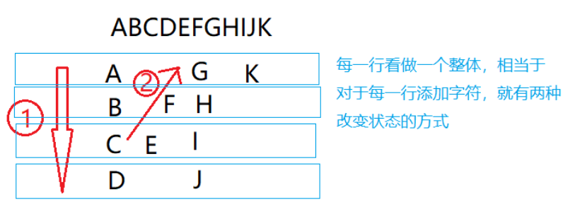
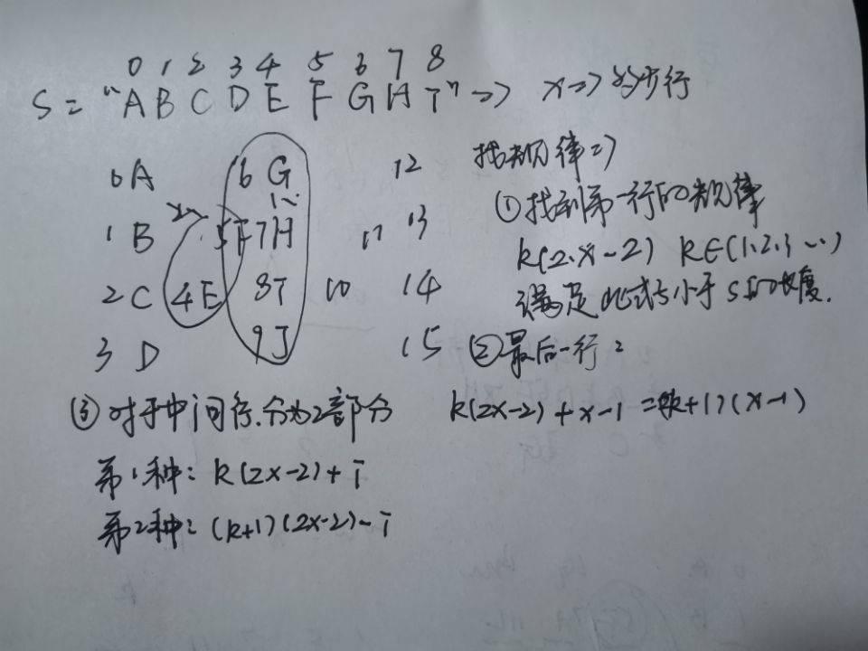

### Z字形变换

<a href="https://leetcode-cn.com/problems/zigzag-conversion/">题目链接</a>

#### 题目描述

将一个给定字符串根据给定的行数，以从上往下、从左到右进行 Z 字形排列。

比如输入字符串为 "LEETCODEISHIRING" 行数为 3 时，排列如下：
```
L   C   I   R
E T O E S I I G
E   D   H   N
```
之后，你的输出需要从左往右逐行读取，产生出一个新的字符串，比如："LCIRETOESIIGEDHN"。

请你实现这个将字符串进行指定行数变换的函数：
```
string convert(string s, int numRows);
```

#### 示例

+ 示例 1:
```
输入: s = "LEETCODEISHIRING", numRows = 3
输出: "LCIRETOESIIGEDHN"
```
+ 示例 2:
```
输入: s = "LEETCODEISHIRING", numRows = 4
输出: "LDREOEIIECIHNTSG"
解释:

L     D     R
E   O E   I I
E C   I H   N
T     S     G
```

#### 方案一： 按行排列

+ 分析

```

从左到右迭代 ss，将每个字符添加到合适的行。可以使用当前行和当前方向这两个变量对合适的行进行跟踪。
只有当我们向上移动到最上面的行或向下移动到最下面的行时，当前方向才会发生改变。

```



+ 代码

```c++
#include<iostream>
#include <vector>
#include <algorithm>
using namespace std;
class Solution {
public:
    string convert(string s, int numRows) {
        if (numRows == 1) return s;
        vector<string> rows(min(numRows, int(s.size())));
        int curRow = 0;
        bool goingDown = false;
        for (char c : s) {
            rows[curRow] += c;
            if (curRow == 0 || curRow == numRows - 1)
                goingDown = !goingDown;
            curRow += goingDown ? 1 : -1;
        }
        string ret;
        for (string row : rows) ret += row;
        return ret;
    }
};
int main() {
    Solution s;
    cout << s.convert("LEETCODEISHIRING", 3);
    return 0;
}

// 需要一个辅助变量flag，用于改变行（亮点）
```

+ 复杂度分析

`时间`： *O*(*n*)，其中 n == len(s)

`空间`： O(n)

#### 方案二： 按行

+ 分析

```
首先访问 行 0 中的所有字符，接着访问 行 1，然后 行 2，依此类推...
```



+ 代码

```c++
class Solution {
public:
    string convert(string s, int numRows) {

        if (numRows == 1) return s;

        string ret;
        int n = s.size();
        int cycleLen = 2 * numRows - 2;

        for (int i = 0; i < numRows; i++) {
            for (int j = 0; j + i < n; j += cycleLen) {
                ret += s[j + i];
                if (i != 0 && i != numRows - 1 && j + cycleLen - i < n)
                    ret += s[j + cycleLen - i];
            }
        }
        return ret;
    }
};
```

+ 复杂度分析

`时间`： O(n)

`空间`：空间复杂度：O(n)。对于 C++ 实现，如果返回字符串不被视为额外空间，则复杂度为 O(1)