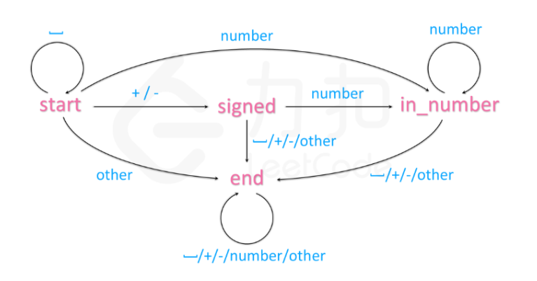

### 字符串转换整数

<a href="https://leetcode-cn.com/problems/string-to-integer-atoi/">题目链接</a>

#### 题目描述

```
请你来实现一个 atoi 函数，使其能将字符串转换成整数。

首先，该函数会根据需要丢弃无用的开头空格字符，直到寻找到第一个非空格的字符为止。接下来的转化规则如下：

如果第一个非空字符为正或者负号时，则将该符号与之后面尽可能多的连续数字字符组合起来，形成一个有符号整数。
假如第一个非空字符是数字，则直接将其与之后连续的数字字符组合起来，形成一个整数。
该字符串在有效的整数部分之后也可能会存在多余的字符，那么这些字符可以被忽略，它们对函数不应该造成影响。
注意：假如该字符串中的第一个非空格字符不是一个有效整数字符、字符串为空或字符串仅包含空白字符时，则你的函数不需要进行转换，即无法进行有效转换。

在任何情况下，若函数不能进行有效的转换时，请返回 0 。

提示：

本题中的空白字符只包括空格字符 ' ' 。
假设我们的环境只能存储 32 位大小的有符号整数，那么其数值范围为 [−231,  231 − 1]。如果数值超过这个范围，请返回  INT_MAX (231 − 1) 或 INT_MIN (−231) 。
```

#### 示例

+ 示例 1:
```
输入: "42"
输出: 42
```
+ 示例 2:
```
输入: "   -42"
输出: -42
解释: 第一个非空白字符为 '-', 它是一个负号。
     我们尽可能将负号与后面所有连续出现的数字组合起来，最后得到 -42 。
```
+ 示例 3:
```
输入: "4193 with words"
输出: 4193
解释: 转换截止于数字 '3' ，因为它的下一个字符不为数字。
```
+ 示例 4:
```
输入: "words and 987"
输出: 0
解释: 第一个非空字符是 'w', 但它不是数字或正、负号。
     因此无法执行有效的转换。
```
+ 示例 5:
```
输入: "-91283472332"
输出: -2147483648
解释: 数字 "-91283472332" 超过 32 位有符号整数范围。 
     因此返回 INT_MIN (−231) 
```

#### 解法一： 直接做

+ 分析

```
第一步： 去掉前面的空格
第二步： 判断正负
第三步： 对数字进行叠加（要判断溢出）
res > INT_MAX / 10 || (res == INT_MAX / 10 && num > 7) --这是对正数进行判断`大于7`是因为INT_MAX 的最后一位是7
```

+ 代码

```c++
#include <iostream>
using namespace std;
class Solution {
public:
    int myAtoi(string str) {
        int res = 0;
        int flag = 1;
        int i = 0;
        while (str[i] == ' ') i++;
        if (str[i] == '-')
            flag = -1;
        if (str[i] == '+' || str[i] == '-')
            i++;
        while (i < str.size() && isdigit(str[i])) {
            int num = str[i] - '0';
            if (res > INT_MAX / 10 || (res == INT_MAX / 10 && num > 7)) {
                
                return (flag == 1) ? INT_MAX : INT_MIN;
            }
            res = res * 10 + num;
            i++;
        }
        return (flag == 1) ? res : -res;
    }
};
int main() {
    Solution s;
    cout << s.myAtoi("-91283472332");
}
```

+ 复杂度分析

`时间`： O(n)其中 n为字符串的长度。我们只需要依次处理所有的字符，处理每个字符需要的时间为 O(1)。

`空间`：O(1)

#### 方案二： DFA(有穷自动机法)

+ 分析

建立如下的自动机



可以把自动机看做一个有向图，用邻接矩阵表示如下

|           | ‘ ’   | +/-    | number    | other |
| --------- | ----- | ------ | --------- | ----- |
| start     | start | signed | in_number | end   |
| signed    | end   | end    | in_number | end   |
| in_number | end   | end    | end       | end   |
| end       | end   | end    | end       | end   |

+ 代码

```c++
class Automaton {
    string state = "start";
    unordered_map<string, vector<string>> table = {
        {"start", {"start", "signed", "in_number", "end"}},
        {"signed", {"end", "end", "in_number", "end"}},
        {"in_number", {"end", "end", "in_number", "end"}},
        {"end", {"end", "end", "end", "end"}}
    };

    int get_col(char c) {
        if (isspace(c)) return 0;
        if (c == '+' or c == '-') return 1;
        if (isdigit(c)) return 2;
        return 3;
    }
public:
    int sign = 1;
    long long ans = 0;

    void get(char c) {
        state = table[state][get_col(c)];
        if (state == "in_number") {
            ans = ans * 10 + c - '0';
            ans = sign == 1 ? min(ans, (long long)INT_MAX) : min(ans, -(long long)INT_MIN);
        }
        else if (state == "signed")
            sign = c == '+' ? 1 : -1;
    }
};

class Solution {
public:
    int myAtoi(string str) {
        Automaton automaton;
        for (char c : str)
            automaton.get(c);
        return automaton.sign * automaton.ans;
    }
};
```

+ 复杂度分析

`时间`：O(n): n为字符串的长度，我们只需要依次处理所有的字符， 处理每个字符需要的时间为O(1)

`空间`：O(1),自动机的状态只需要常数空间储存。