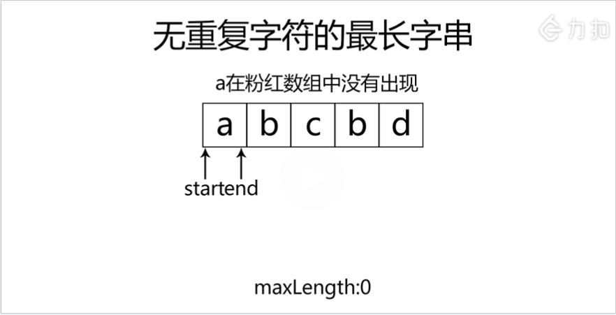

### 无重复字符的最长子串

<a href="https://leetcode-cn.com/problems/longest-substring-without-repeating-characters/">题目链接</a>

#### 题目描述

```
给定一个字符串，请你找出其中不含有重复字符的 最长子串 的长度
```

#### 示例

+ 示例 1:
```
输入: "abcabcbb"
输出: 3 
解释: 因为无重复字符的最长子串是 "abc"，所以其长度为 3。
```
+ 示例 2:
```
输入: "bbbbb"
输出: 1
解释: 因为无重复字符的最长子串是 "b"，所以其长度为 1。
```
+ 示例 3:
```
输入: "pwwkew"
输出: 3
解释: 因为无重复字符的最长子串是 "wke"，所以其长度为 3。
     请注意，你的答案必须是 子串 的长度，"pwke" 是一个子序列，不是子串。
```

#### 解法一： 滑动窗口

+ 分析



+ 代码

```c++
class Solution
{
public:
    int lengthOfLongestSubstring(string s)
    {
        //s[start,end) 前面包含 后面不包含
        int start(0), end(0), length(0), result(0);
        int sSize = int(s.size());
        while (end < sSize)
        {
            char tmpChar = s[end];
            for (int index = start; index < end; index++)
            {
                if (tmpChar == s[index])
                {
                    start = index + 1;
                    length = end - start;
                    break;
                }
            }

            end++;
            length++;
            result = max(result, length);
        }
        return result;
    }
};
```

+ 优化

```
使用hashmap或者桶排序代替中间查找的过程
```

```c++
class Solution
{
public:
    int lengthOfLongestSubstring(string s)
    {
        //s[start,end) 前面包含 后面不包含
        int start(0), end(0), length(0), result(0);
        int sSize = int(s.size());
        unordered_map<char, int> hash;
        while (end < sSize)
        {
            char tmpChar = s[end];
            //仅当s[start,end) 中存在s[end]时更新start
            if (hash.find(tmpChar) != hash.end() && hash[tmpChar] >= start)
            {
                start = hash[tmpChar] + 1;
                length = end - start;
            }
            hash[tmpChar] = end;

            end++;
            length++;
            result = max(result, length);
        }
        return result;
    }
};
```

```c++
class Solution
{
public:
    int lengthOfLongestSubstring(string s)
    {
        //s[start,end) 前面包含 后面不包含
        int start(0), end(0), length(0), result(0);
        int sSize = int(s.size());
        vector<int> vec(128, -1);
        while (end < sSize)
        {
            char tmpChar = s[end];
            //仅当s[start,end) 中存在s[end]时更新start
            if (vec[int(tmpChar)] >= start)
            {
                start = vec[int(tmpChar)] + 1;
                length = end - start;
            }
            vec[int(tmpChar)] = end;

            end++;
            length++;
            result = max(result, length);
        }
        return result;
    }
};
```

