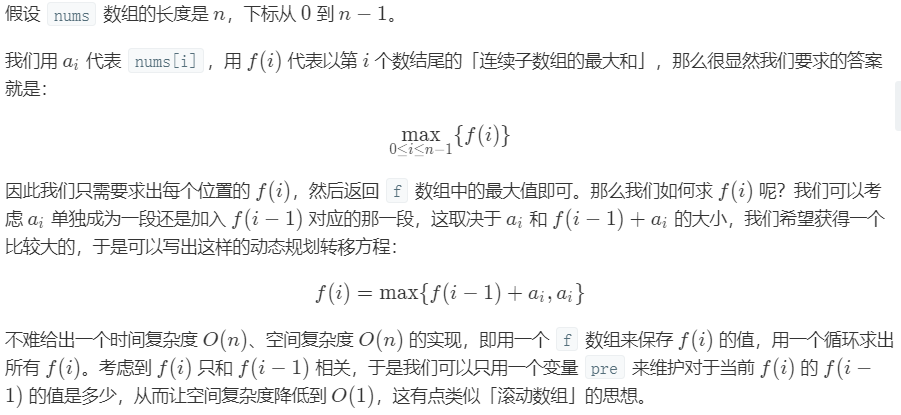
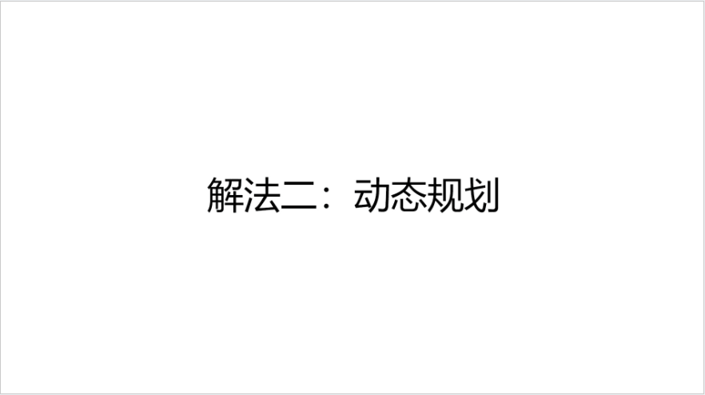
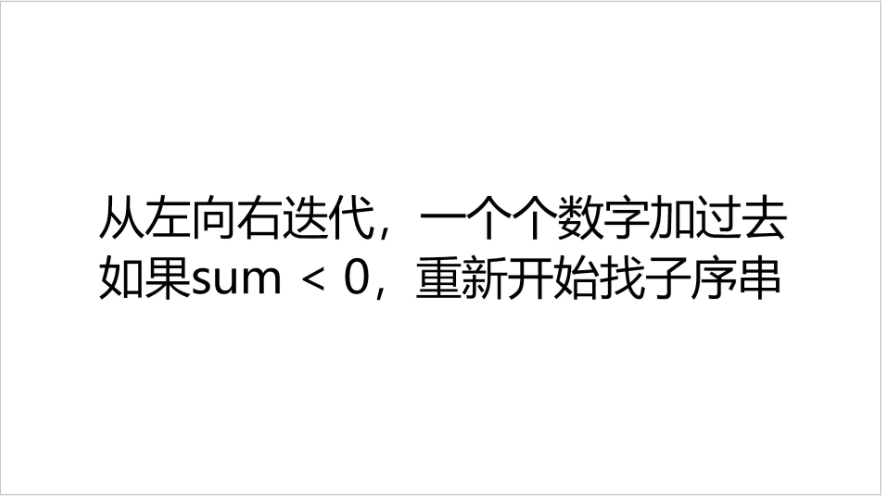

### 最大子序和

<a href="https://leetcode-cn.com/problems/maximum-subarray/"></a>

#### 题目描述

给定一个整数数组 `nums` ，找到一个具有最大和的连续子数组（子数组最少包含一个元素），返回其最大和。

#### 示例

```
输入: [-2,1,-3,4,-1,2,1,-5,4],
输出: 6
解释: 连续子数组 [4,-1,2,1] 的和最大，为 6。
```

#### 解法一：暴力法

+ 分析

直接两重循环找到最好序列

+ 代码

```c++
class Solution
{
public:
    int maxSubArray(vector<int> &nums)
    {
        //类似寻找最大最小值的题目，初始值一定要定义成理论上的最小最大值
        int max = INT_MIN;
        int numsSize = int(nums.size());
        for (int i = 0; i < numsSize; i++)
        {
            int sum = 0;
            for (int j = i; j < numsSize; j++)
            {
                sum += nums[j];
                if (sum > max)
                {
                    max = sum;
                }
            }
        }

        return max;
    }
};


```

+ 复杂度分析

`时间`：O(n^2)

`空间`：O(1)

#### 解法二: 分治法

+ 分析

```
求A[low, high]中的最大子序列
mid = (low + high) / 2;
那么最大子序列必定处于以下三种情况中
 1.处于A[low, mid]中
 2.处于A[mid + 1, high]
 3.跨域mid
```

+ 代码

```c++
#include<iostream>
#include<algorithm>
#include<vector>
using namespace std;
class Solution {
public:
    int maxSubArray(vector<int>& nums) {
        return findMaximumSubarray(nums, 0, nums.size() - 1);
    }
private:
    int findMaxCrossingSubarray(vector<int>& nums, int low, int mid, int high) {
        int leftSum = INT_MIN, sum = 0;
        for (int i = mid; i >= low; i--) {
            sum += nums[i];
            if (sum > leftSum) {
                leftSum = sum;
            }
        }
        int rightSum = INT_MIN;
        sum = 0;
        for (int i = mid + 1; i <= high; i++) {
            sum += nums[i];
            if (sum > rightSum)
                rightSum = sum;
        }
        return leftSum + rightSum;
    }
    int findMaximumSubarray(vector<int>& nums, int low, int high) {
        if (high == low)
            return nums[low];
        else {
            int mid = (high + low) / 2;
            int left = findMaximumSubarray(nums, low, mid);
            int right = findMaximumSubarray(nums, mid + 1, high);
            int cross = findMaxCrossingSubarray(nums, low, mid, high);
            if (left >= right && left >= cross)
                return left;
            else if (right >= left && right >= cross)
                return right;
            else
                return cross;
        }
    }
};

int main() {
    vector<int> nums;
    nums.push_back(-2);
    nums.push_back(1);
    nums.push_back(-3);
    nums.push_back(4);
    nums.push_back(-1);
    nums.push_back(2);
    nums.push_back(1);
    nums.push_back(-5);
    nums.push_back(4);
    Solution s;
    cout << s.maxSubArray(nums);
}
// findMaxCrossingSubarray函数是求跨中点的
```

+ 复杂度分析

`时间`：O(nlogn)

`空间`： O(1)

#### 解法三： 动态规划

+ 分析







+ 代码

```c++
class Solution
{
public:
    int maxSubArray(vector<int> &nums)
    {
        //类似寻找最大最小值的题目，初始值一定要定义成理论上的最小最大值
        int result = INT_MIN;
        int numsSize = int(nums.size());
        //dp[i]表示nums中以nums[i]结尾的最大子序和
        vector<int> dp(numsSize);
        dp[0] = nums[0];
        result = dp[0];
        for (int i = 1; i < numsSize; i++)
        {
            dp[i] = max(dp[i - 1] + nums[i], nums[i]);
            result = max(result, dp[i]);
        }

        return result;
    }
};
```

+ 复杂度分析

`时间`：O(n)

`空间`：O(1)


#### 解法四： 贪心算法

+ 分析



+ 代码

```c++
class Solution
{
public:
    int maxSubArray(vector<int> &nums)
    {
        //类似寻找最大最小值的题目，初始值一定要定义成理论上的最小最大值
        int result = INT_MIN;
        int numsSize = int(nums.size());
        int sum = 0;
        for (int i = 0; i < numsSize; i++)
        {
            sum += nums[i];
            result = max(result, sum);
            //如果sum < 0，重新开始找子序串
            if (sum < 0)
            {
                sum = 0;
            }
        }

        return result;
    }
};
```


> 参考自
> 作者：pinku-2
> 链接：https://leetcode-cn.com/problems/maximum-subarray/solution/zui-da-zi-xu-he-cshi-xian-si-chong-jie-fa-bao-li-f/