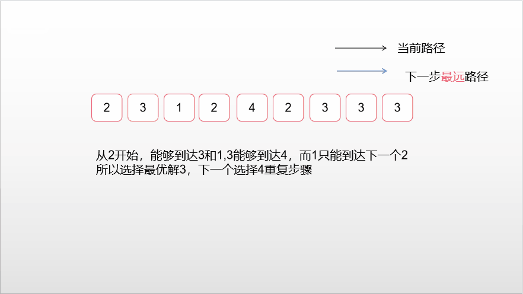

### 跳跃游戏

<a href="https://leetcode-cn.com/problems/jump-game-ii/">题目链接</a>

#### 题目描述

```
给定一个非负整数数组，你最初位于数组的第一个位置。

数组中的每个元素代表你在该位置可以跳跃的最大长度。

你的目标是使用最少的跳跃次数到达数组的最后一个位置。
```

#### 示例

```
输入: [2,3,1,1,4]
输出: 2
解释: 跳到最后一个位置的最小跳跃数是 2。
     从下标为 0 跳到下标为 1 的位置，跳 1 步，然后跳 3 步到达数组的最后一个位置。
```

#### 解法一： 动态规划

```
如果某一个作为 起跳点 的格子可以跳跃的距离是 3，那么表示后面 3 个格子都可以作为 起跳点。
11. 可以对每一个能作为 起跳点 的格子都尝试跳一次，把 能跳到最远的距离 不断更新。

如果从这个 起跳点 起跳叫做第 1 次 跳跃，那么从后面 3 个格子起跳 都 可以叫做第 2 次 跳跃。

所以，当一次 跳跃 结束时，从下一个格子开始，到现在 能跳到最远的距离，都 是下一次 跳跃 的 起跳点。
31. 对每一次 跳跃 用 for 循环来模拟。
32. 跳完一次之后，更新下一次 起跳点 的范围。
33. 在新的范围内跳，更新 能跳到最远的距离。

记录 跳跃 次数，如果跳到了终点，就得到了结果。
```

+ 代码

```c++
class Solution {
public:
    int jump(vector<int>& nums) {
        int n = nums.size();
        vector<int> f(n, 0x3f3f3f3f);
        for (int i = 0; i < n; i++) {
            if (!i) f[i] = 0; // 处理边界
            else {
                for (int j = 0; j < i; j++) { 
                    if (j + nums[j] >= i) { // 只要前面的点能跳到i点就更新最小值
                        f[i] = min(f[i], f[j] + 1);
                    }
                }
            }
        }
        return f[n - 1];
    }
};

```

+ 复杂度分析

```
时间：O(n^2)
空间：O(1)
```


#### 解法二：贪心

+ 分析



+ 代码

```c++
class Solution {
    public int jump(int[] nums) {
        int length = nums.length;
        int end = 0;
        int maxPosition = 0; 
        int steps = 0;
        for (int i = 0; i < length - 1; i++) {
            maxPosition = Math.max(maxPosition, i + nums[i]); 
            if (i == end) {
                end = maxPosition;
                steps++;
            }
        }
        return steps;
    }
}
```

+ 复杂度分析

```
时间：O(n)
空间：O(1)
```

