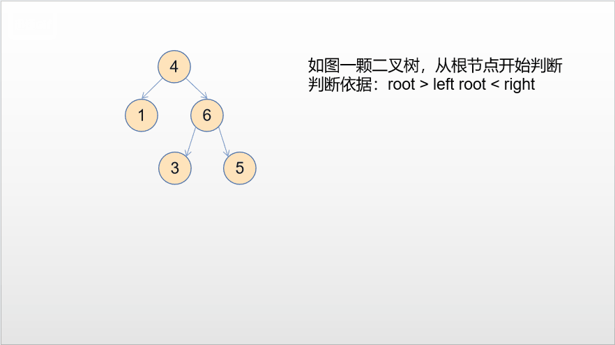

### 验证二叉搜索树

<a href="https://leetcode-cn.com/problems/validate-binary-search-tree/">题目链接</a>

#### 题目

```
给定一个二叉树，判断其是否是一个有效的二叉搜索树。

假设一个二叉搜索树具有如下特征：

节点的左子树只包含小于当前节点的数。
节点的右子树只包含大于当前节点的数。
所有左子树和右子树自身必须也是二叉搜索树。
```

#### 示例

+ 示例一：

```
输入:
    2
   / \
  1   3
输出: true
```

+ 示例二

```
输入:
    5
   / \
  1   4
     / \
    3   6
输出: false
解释: 输入为: [5,1,4,null,null,3,6]。
     根节点的值为 5 ，但是其右子节点值为 4 。
```

#### 解法一：定义

+ 分析

```
从根节点开始跟左孩子和右孩子比较，如果成立，则递归比较左子树和右子树
```




+ 代码

```c++
class Solution {
public:
    bool helper(TreeNode* root, long long lower, long long upper) {
        if (root == nullptr) return true;
        if (root -> val <= lower || root -> val >= upper) return false;
        return helper(root -> left, lower, root -> val) && helper(root -> right, root -> val, upper);
    }
    bool isValidBST(TreeNode* root) {
        return helper(root, LONG_MIN, LONG_MAX);
    }
};
```

+ 复杂度

```
时间：O(n)
空间：O(n)
```

#### 解法二：中序遍历

+ 分析

```
二叉搜索树「中序遍历」得到的值构成的序列一定是升序的，这启示我们在中序遍历的时候实时检查当前节点的值是否大于前一个中序遍历到的节点的值即可。如果均大于说明这个序列是升序的，整棵树是二叉搜索树，否则不是。
```


+ 代码

```c++
class Solution {
public:
    bool isValidBST(TreeNode* root) {
        stack<TreeNode*> stack;
        long long inorder = (long long)INT_MIN - 1;

        while (!stack.empty() || root != nullptr) {
            while (root != nullptr) {
                stack.push(root);
                root = root -> left;
            }
            root = stack.top();
            stack.pop();
            // 如果中序遍历得到的节点的值小于等于前一个 inorder，说明不是二叉搜索树
            if (root -> val <= inorder) return false;
            inorder = root -> val;
            root = root -> right;
        }
        return true;
    }
};
```

+ 复杂度分析

```
时间：O(n)
空间：O(n)
```

