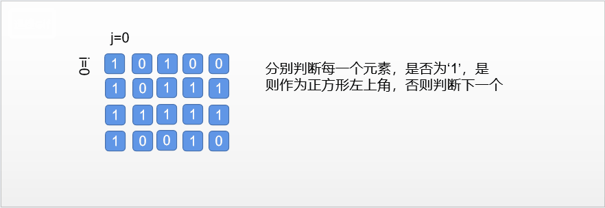
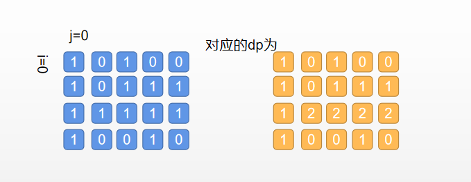

### 最大正方形

<a href="https://leetcode-cn.com/problems/maximal-square">题目链接</a>

#### 题目描述

```
在一个由 0 和 1 组成的二维矩阵内，找到只包含 1 的最大正方形，并返回其面积
```

#### 示例

```
1 0 1 0 0
1 0 1 1 1
1 1 1 1 1
1 0 0 1 0

输出: 4
```

#### 解法一： 暴力法

+ 分析

```
去判断矩阵中的每一个元素，只要等于‘1’，就向下和右延伸判断，知道找到最大的那个
```



+ 代码

```c++
#include<iostream>
#include<algorithm>
#include<vector>
using namespace std;
class Solution {
public:
	int maximalSquare(vector<vector<char>>& matrix) {
		if (matrix.size() == 0 || matrix[0].size() == 0)
			return 0;
		int maxSide = 0;
		int rows = matrix.size(), columns = matrix[0].size();
		for (int i = 0; i < rows; i++) {
			for (int j = 0; j < columns; j++) {
				if (matrix[i][j] == '1') {
					// 遇到一个1作为正方形的左上角
					maxSide = max(maxSide, 1);
					// 计算可能的最大正方形边长
					int currentMaxSide = min(rows - i, columns - j);
					for (int k = 1; k < currentMaxSide; k++) {
						// 判断新增的一行一列是否均为1
						bool flag = true;
						if (matrix[i + k][j + k] == '0')
							break;
						for (int m = 0; m < k; m++) {
							if (matrix[i + k][j + m] == '0' || matrix[i + m][j + k] == '0') {
								flag = false;
								break;
							}
						}
						if (flag) {
							maxSide = max(maxSide, k + 1);
						}
						else {
							break;
						}
					}
				}
			}
		}
		int maxSquare = maxSide * maxSide;
		return maxSquare;
	}
};
int main() {
	vector<vector<char>> matrix;
	matrix.push_back({ '1', '0', '1', '0', '0' });
	matrix.push_back({ '1', '0', '1', '1', '1' });
	matrix.push_back({ '1', '1', '1', '1', '1' });
	matrix.push_back({ '1', '0', '0', '1', '0' });
	Solution s;
	cout << s.maximalSquare(matrix);
	return 0;
}
```

+ 复杂度分析

```
时间复杂度：O(mn*min(m,n)^2)，其中 m和 n是矩阵的行数和列数。

    需要遍历整个矩阵寻找每个，遍历矩阵的时间复杂度是 O(mn)。
	对于每个可能的正方形，其边长不超过 m和 n中的最小值，需要遍历该正方形中的每个元素判断	是不是只包含，遍历正方形时间复杂度是 O(\min(m,n)^2)
	总时间复杂度是 O(mn*min(m,n)^2)；
空间复杂度：O(1)。额外使用的空间复杂度为常数。
```

#### 解法二： 动态规划

+ 分析

```
。我们用 dp(i, j) 表示以 (i, j) 为右下角，且只包含 1的正方形的边长最大值。如果我们能计算出所有 dp(i, j)的值，那么其中的最大值即为矩阵中只包含 1的正方形的边长最大值，其平方即为最大正方形的面积。
```

+ 如果该位置的值是 0，则 dp(i, j) = 0因为当前位置不可能在由 1组成的正方形中；

+ 如果该位置的值是 1，则 dp(i, j)的值由其上方、左方和左上方的三个相邻位置的 dp 值决定。具体而言，当前位置的元素值等于三个相邻位置的元素中的最小值加 11，状态转移方程如下：

```c++
dp(i, j)=min(dp(i−1, j), dp(i−1, j−1), dp(i, j−1))+1
```
例如：



+ 代码

```c++
class Solution {
public:
	int maximalSquare(vector<vector<char>>& matrix) {
		if (matrix.size() == 0 || matrix[0].size() == 0) {
			return 0;
		}
		int maxSide = 0;
		int rows = matrix.size(), columns = matrix[0].size();
		vector<vector<int>> dp(rows, vector<int>(columns));
		for (int i = 0; i < rows; i++) {
			for (int j = 0; j < columns; j++) {
				if (matrix[i][j] == '1') {
					if (i == 0 || j == 0) {
						dp[i][j] = 1;
					}
					else {
						dp[i][j] = min(min(dp[i - 1][j], dp[i][j - 1]), dp[i - 1][j - 1]) + 1;
					}
					maxSide = max(maxSide, dp[i][j]);
				}
			}
		}
		int maxSquare = maxSide * maxSide;
		return maxSquare;
	}
};
```

+ 复杂度分析

```
时间：O(nm)
空间：O(nm)
```

