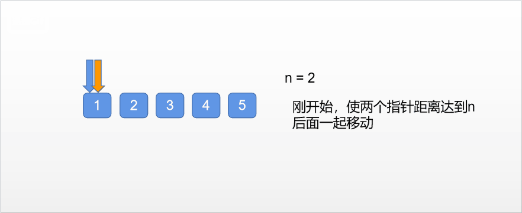

### 删除链表的倒数第N个节点

<a href="https://leetcode-cn.com/problems/remove-nth-node-from-end-of-list/">题目链接</a>

#### 题目描述

```
给定一个链表，删除链表的倒数第 n 个节点，并且返回链表的头结点。
```

#### 示例

```
给定一个链表: 1->2->3->4->5, 和 n = 2.

当删除了倒数第二个节点后，链表变为 1->2->3->5.
```

假定给定的n保证是有效的

#### 解法

+ 分析

```
可以通过先通过一次遍历求出链表的长度，然后在遍历到length - n的节点
但我希望只通过一次遍历就可以解决，通过设置两个指针，刚开始使两个指针的距离达到n然后一起
向后移动，那么左边的节点所指的就是我们需要删除的节点的前一个节点
```


+ 代码

```c++
class Solution {
public:
    ListNode* removeNthFromEnd(ListNode* head, int n) {
        ListNode* dummy = new ListNode(0);  //哑节点
        if (!head)  return head;
        dummy->next = head;
        ListNode* p = dummy;
        ListNode* q = dummy;
        for (int i = 0; i < n; i++)
        {
            q = q->next;
        }
        while (q->next)
        {
            p = p->next;
            q = q->next;
        }
        p->next = p->next->next;  //删除p->next的节点

        ListNode* res = dummy->next;
        delete dummy;   //删除哑节点
        return res;

    }
};
```

+ 复杂度分析

```
时间：O(n)
空间：O(1)
```

