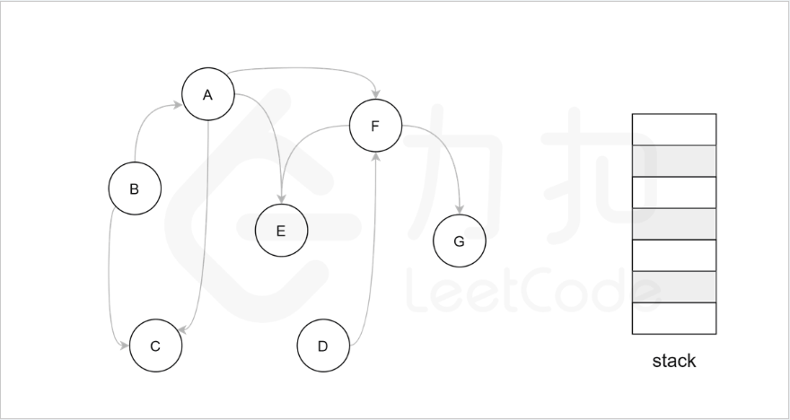
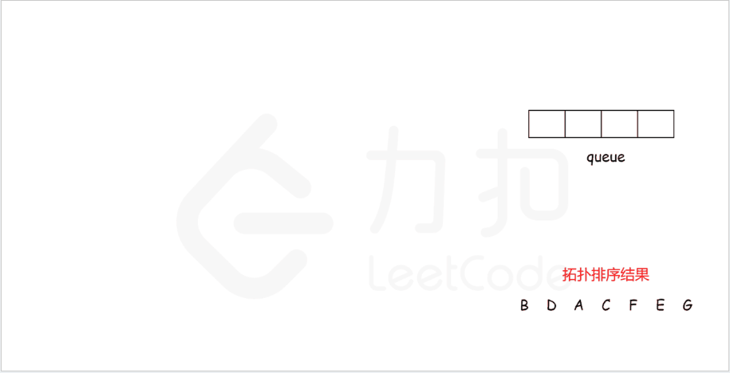

### 课程表II

<a href="https://leetcode-cn.com/problems/course-schedule-ii/">题目链接</a>

#### 题目描述

```
现在你总共有 n 门课需要选，记为 0 到 n-1。

在选修某些课程之前需要一些先修课程。 例如，想要学习课程 0 ，你需要先完成课程 1 ，我们用一个匹配来表示他们: [0,1]

给定课程总量以及它们的先决条件，返回你为了学完所有课程所安排的学习顺序。

可能会有多个正确的顺序，你只要返回一种就可以了。如果不可能完成所有课程，返回一个空数组。
```

#### 示例

+ 1

```
输入: 2, [[1,0]] 
输出: [0,1]
解释: 总共有 2 门课程。要学习课程 1，你需要先完成课程 0。因此，正确的课程顺序为 [0,1] 。
```

+ 2

```
输入: 4, [[1,0],[2,0],[3,1],[3,2]]
输出: [0,1,2,3] or [0,2,1,3]
解释: 总共有 4 门课程。要学习课程 3，你应该先完成课程 1 和课程 2。并且课程 1 和课程 2 都应该排在课程 0 之后。
     因此，一个正确的课程顺序是 [0,1,2,3] 。另一个正确的排序是 [0,2,1,3] 。

```

#### 题解一： 深度搜索

+ 分析

```
由题目分析可得课程相当于组成了一个有向图，而题解就相当于是遍历有向图中的所有节点而且没有回路
```

我们可以将深度优先搜索的流程与拓扑排序的求解联系起来，用一个栈来存储所有已经搜索完成的节点。

+ 对于一个节点 `u`，如果它的所有`相邻节点`都已经搜索完成，那么在搜索回溯到 u 的时候，u 本身也会变成一个已经搜索完成的节点。这里的「相邻节点」指的是从 u 出发通过一条有向边可以到达的所有节点。

+ 假设我们当前搜索到了节点 u，如果它的所有相邻节点都已经搜索完成，那么这些节点都已经在栈中了，此时我们就可以把 u 入栈。可以发现，如果我们从栈顶往栈底的顺序看，由于 u 处于栈顶的位置，那么 u 出现在所有 uu 的相邻节点的前面。因此对于 u 这个节点而言，它是满足拓扑排序的要求的。

这样以来，我们对图进行一遍深度优先搜索。当每个节点进行回溯的时候，我们把该节点放入栈中。最终从栈顶到栈底的序列就是一种拓扑排序。

+ 算法

对于图中的任意一个节点，它在搜索的过程中有三种状态，即：
      + 「未搜索」：我们还没有搜索到这个节点；
            + 「搜索中」：我们搜索过这个节点，但还没有回溯到该节点，即该节点还没有入栈，还有相邻的节点没有搜索完成）；
            + 「已完成」：我们搜索过并且回溯过这个节点，即该节点已经入栈，并且所有该节点的相邻节点都出现在栈的更底部的位置，满足拓扑排序的要求。

通过上述的三种状态，我们就可以给出使用深度优先搜索得到拓扑排序的算法流程，在每一轮的搜索搜索开始时，我们任取一个「未搜索」的节点开始进行深度优先搜索。
```
我们将当前搜索的节点 u 标记为「搜索中」，遍历该节点的每一个相邻节点 v：

如果 v 为「未搜索」，那么我们开始搜索 v，待搜索完成回溯到 u；

如果 v 为「搜索中」，那么我们就找到了图中的一个环，因此是不存在拓扑排序的；

如果 v 为「已完成」，那么说明 v 已经在栈中了，而 u 还不在栈中，因此 u 无论何时入栈都不会影响到 (u, v)(u,v) 之前的拓扑关系，以及不用进行任何操作。

当 u 的所有相邻节点都为「已完成」时，我们将 u 放入栈中，并将其标记为「已完成」。

在整个深度优先搜索的过程结束后，如果我们没有找到图中的环，那么栈中存储这所有的 n 个节点，从栈顶到栈底的顺序即为一种拓扑排序。
```



+ 代码

```c++
class Solution {
private:
    // 存储有向图
    vector<vector<int>> edges;
    // 标记每个节点的状态：0=未搜索，1=搜索中，2=已完成
    vector<int> visited;
    // 用数组来模拟栈，下标 0 为栈底，n-1 为栈顶
    vector<int> result;
    // 判断有向图中是否有环
    bool invalid;

public:
    void dfs(int u) {
        // 将节点标记为「搜索中」
        visited[u] = 1;
        // 搜索其相邻节点
        // 只要发现有环，立刻停止搜索
        for (int v: edges[u]) {
            // 如果「未搜索」那么搜索相邻节点
            if (visited[v] == 0) {
                dfs(v);
                if (invalid) {
                    return;
                }
            }
            // 如果「搜索中」说明找到了环
            else if (visited[v] == 1) {
                invalid = true;
                return;
            }
        }
        // 将节点标记为「已完成」
        visited[u] = 2;
        // 将节点入栈
        result.push_back(u);
    }

    vector<int> findOrder(int numCourses, vector<vector<int>>& prerequisites) {
        edges.resize(numCourses);
        visited.resize(numCourses);
        for (const auto& info: prerequisites) {
            edges[info[1]].push_back(info[0]);
        }
        // 每次挑选一个「未搜索」的节点，开始进行深度优先搜索
        for (int i = 0; i < numCourses && !invalid; ++i) {
            if (!visited[i]) {
                dfs(i);
            }
        }
        if (invalid) {
            return {};
        }
        // 如果没有环，那么就有拓扑排序
        // 注意下标 0 为栈底，因此需要将数组反序输出
        reverse(result.begin(), result.end());
        return result;
    }
};
```

+ 复杂度分析

```
时间：O(n+m)
空间：O(n+m)
```

#### 解法二：广度优先搜索

+ 分析

```
我们使用一个队列来进行广度优先搜索。初始时，所有入度为 0 的节点都被放入队列中，它们就是可以作为拓扑排序最前面的节点，并且它们之间的相对顺序是无关紧要的。

在广度优先搜索的每一步中，我们取出队首的节点 u：

我们将 u 放入答案中；

我们移除 u 的所有出边，也就是将 u 的所有相邻节点的入度减少 1。如果某个相邻节点 v 的入度变为 0，那么我们就将 vv 放入队列中。

在广度优先搜索的过程结束后。如果答案中包含了这 n 个节点，那么我们就找到了一种拓扑排序，否则说明图中存在环，也就不存在拓扑排序了
```



+ 代码

```c++
class Solution {
private:
    // 存储有向图
    vector<vector<int>> edges;
    // 存储每个节点的入度
    vector<int> indeg;
    // 存储答案
    vector<int> result;

public:
    vector<int> findOrder(int numCourses, vector<vector<int>>& prerequisites) {
        edges.resize(numCourses);
        indeg.resize(numCourses);
        for (const auto& info: prerequisites) {
            edges[info[1]].push_back(info[0]);
            ++indeg[info[0]];
        }

        queue<int> q;
        // 将所有入度为 0 的节点放入队列中
        for (int i = 0; i < numCourses; ++i) {
            if (indeg[i] == 0) {
                q.push(i);
            }
        }

        while (!q.empty()) {
            // 从队首取出一个节点
            int u = q.front();
            q.pop();
            // 放入答案中
            result.push_back(u);
            for (int v: edges[u]) {
                --indeg[v];
                // 如果相邻节点 v 的入度为 0，就可以选 v 对应的课程了
                if (indeg[v] == 0) {
                    q.push(v);
                }
            }
        }

        if (result.size() != numCourses) {
            return {};
        }
        return result;
    }
};
```

+ 复杂度分析

```
时间复杂度:O(n+m)，其中 n 为课程数，m 为先修课程的要求数。这其实就是对图进行广度优先搜索的时间复杂度。

空间复杂度:O(n+m)。题目中是以列表形式给出的先修课程关系，为了对图进行广度优先搜索，我们需要存储成邻接表的形式，空间复杂度为 O(m)。在广度优先搜索的过程中，我们需要最多 O(n) 的队列空间（迭代）进行广度优先搜索，并且还需要若干个O(n) 的空间存储节点入度、最终答案等
```

