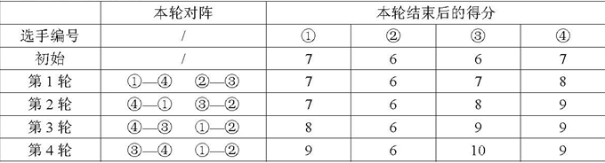

### 瑞士轮

<a href="https://ac.nowcoder.com/acm/problem/16586">题目链接</a>

#### 题目描述

```
在双人对决的竞技性比赛，如乒乓球、羽毛球、国际象棋中，最常见的赛制是淘汰赛和循环赛。前者的特点是比赛场数少，每场都紧张刺激，但偶然性较高。后者的特点是较为公平，偶然性较低，但比赛过程往往十分冗长。
本题中介绍的瑞士轮赛制，因最早使用于 1895 年在瑞士举办的国际象棋比赛而得名。它可以看作是淘汰赛与循环赛的折中，既保证了比赛的稳定性，又能使赛程不至于过长
2×N 名编号为1∼2N 的选手共进行R 轮比赛。每轮比赛开始前，以及所有比赛结束后，都会按照总分从高到低对选手进行一次排名。选手的总分为第一轮开始前的初始分数加上已参加过的所有比赛的得分和。总分相同的，约定编号较小的选手排名靠前。

每轮比赛的对阵安排与该轮比赛开始前的排名有关：第1 名和第2 名、第3 名和第 4 名、……、第2K−1名和第2K名、…… 、第2N−1名和第2N名，各进行一场比赛。每场比赛胜者得1分，负者得0 分。也就是说除了首轮以外，其它轮比赛的安排均不能事先确定，而是要取决于选手在之前比赛中的表现。

现给定每个选手的初始分数及其实力值，试计算在R 轮比赛过后，排名第Q 的选手编号是多少。我们假设选手的实力值两两不同，且每场比赛中实力值较高的总能获胜
```

+ 输入描述

```

第一行是三个正整数 N,R ,Q ,每两个数之间用一个空格隔开，表示有 2 x N 名选手、 R 轮比赛，以及我们关心的名次 Q 。
第二行是 2 x N 个非负整数 s1, s2, …, s2N ，每两个数之间用一个空格隔开，其中 si 表示编号为 i 的选手的初始分数。 
第三行是 2 x N 个正整数 w1 , w2 , …, w2N ，每两个数之间用一个空格隔开，其中 wi 表示编号为 i 的选手的实力值。
```

+ 输出描述

```
一个整数，即 R 轮比赛结束后，排名第 Q 的选手的编号。
```

#### 示例

```
输入：
2 4 2 
7 6 6 7 
10 5 20 15
输出
1
```



#### 题解

+ 分析

```
此题中的排序是关键字排序： 总分较大者优先， 编号较小者优先
初始时先将所有参赛队员排序，这里可以采用快速排序，时间复杂度是 O(nlogn)。

接下来每轮比赛结束后，均需要将所有选手重新排序。

如果采用快速排序，则总时间复杂度是 O(NRlogN)，会超时；
可以发现每次比赛会将 N 个同学的分数加0，另外 N 个同学的分数加1，所有加0的 N 个同学内部是有序的，加1的 N 个同学内部也是有序的，因此这一步需要我们将两个有序序列合并，使用二路归并算法即可，每次归并的时间复杂度是O(N)。
```

+ 代码

```c++
#include <cstdio>
#include <cstring>
#include <iostream>
#include <algorithm>

using namespace std;
const int N = 200010;
int n, m, k; // 2*n 表示参赛人数, m: 表示比赛轮数，k: 所求排名数

int s[N], w[N], q[N], q0[N], q1[N];

bool cmp(int a, int b) {
	if (s[a] != s[b]) return s[a] > s[b];
	return a < b;
}

int main() {
	// scanf("%d%d%d", &n, &m, &k);

	cin >> n >> m >> k;
	for (int i = 0; i < n * 2; i++) cin >> s[i]; // 输入初始积分
	for (int i = 0; i < n * 2; i++) cin >> w[i]; // 输入战力
	for (int i = 0; i < n * 2; i++) q[i] = i;  // 记录初始排名

	sort(q, q + n * 2, cmp); // 初始排名

	while (m--) {
		int t0 = 0, t1 = 0;
		for (int i = 0; i < n * 2; i += 2) {
			int a = q[i], b = q[i + 1];
			if (w[a] < w[b]) {
				s[b] ++; 
				q0[t0++] = a;
				q1[t1++] = b;
			}
			else
			{
				s[a] ++;
				q0[t0++] = b;
				q1[t1++] = a;
			}
		}
		int i = 0, j = 0, t = 0;
		while (i < t0 && j < t1)
			if (cmp(q0[i], q1[j]))
				q[t++] = q0[i++];
			else
				q[t++] = q1[j++];
		while (i < t0) q[t++] = q0[i++];
		while (j < t1) q[t++] = q1[j++];
	}
	cout << q[k - 1] + 1;
	return 0;
}
```

